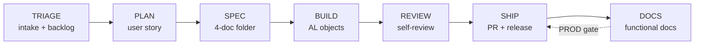

# When to use which BC agent / skill

A quick decision map for the Business Central ALM toolkit in this repo. If you are unsure,
start with the **`bc-orchestrator`** — give it a ticket ID and it will tell you which
stage you are in and which agent to switch to.

## The lifecycle



## Decision map

| If you want to… | Phase | Use agent | Backed by skill |
|---|---|---|---|
| Find out what to do next for a ticket | — | **bc-orchestrator** | _(orchestrator)_ |
| Intake, triage, prioritize or groom the backlog | TRIAGE | **bc-pm** | [`bc-triage-backlog`](skills/bc-triage-backlog/SKILL.md) |
| Turn a triaged ticket into a user story + criteria | PLAN | **bc-plan** | [`bc-plan-user-story`](skills/bc-plan-user-story/SKILL.md) |
| Write the full `specs/ABC-{ID}-*/` folder | SPEC | **bc-spec** | [`bc-spec-author`](skills/bc-spec-author/SKILL.md) |
| Implement AL objects, bump `app.json`, add tests | BUILD | **bc-dev** | [`bc-build-feature`](skills/bc-build-feature/SKILL.md) |
| Self-check the branch before a PR | REVIEW | **bc-dev** / **bc-pr** | [`bc-review-self`](skills/bc-review-self/SKILL.md) |
| Compose the PR description + checklist | SHIP | **bc-pr** | [`bc-ship-pull-request`](skills/bc-ship-pull-request/SKILL.md) |
| Compose a release branch, deploy to TEST/PROD | SHIP | **bc-deploy** | [`bc-ship-release`](skills/bc-ship-release/SKILL.md) |
| Write customer-facing functional docs (PROD gate) | DOCS | **bc-doc** | [`bc-docs-feature`](skills/bc-docs-feature/SKILL.md) |
| Author/maintain CI/CD (GitHub Actions, AL-Go) | CI/CD | **bc-workflow** | [`bc-cicd-pipeline`](skills/bc-cicd-pipeline/SKILL.md) |
| Format a commit message | any | _(any)_ | [`bc-util-commit-message`](skills/bc-util-commit-message/SKILL.md) |
| **Set up this template for a new project** | setup | **bc-init** | [`bc-init-template`](skills/bc-init-template/SKILL.md) |

## Agents vs skills — which do I invoke?

- **Skills** trigger automatically when your request matches their `Use when:` phrases, in any
  Copilot surface. They are the *procedures*.
- **Agents** are *personas* you switch to deliberately (in VS Code / the CLI agent picker).
  Each agent reads its backing skill, so you get the same procedure either way — the agent just
  adds a tool profile, a model, and `handoffs:` to step to the next phase.

Rule of thumb: **driving a feature through its lifecycle → use the agents** (and their
handoffs). **One-off "how do I…" question → let the skill fire.**

## Handoff chain

```
bc-orchestrator ──▶ bc-pm ──▶ bc-plan ──▶ bc-spec ──▶ bc-dev ──▶ bc-pr ──▶ bc-deploy ──▶ bc-doc
                                                          ◀── (changes requested)         │
                                                                    (PROD gate) ◀─────────┘

utilities (outside the lifecycle):  bc-workflow (CI/CD)   ·   bc-init (one-time setup)
```

See [`AGENT-ARCHITECTURE.md`](AGENT-ARCHITECTURE.md) for the design rationale.
